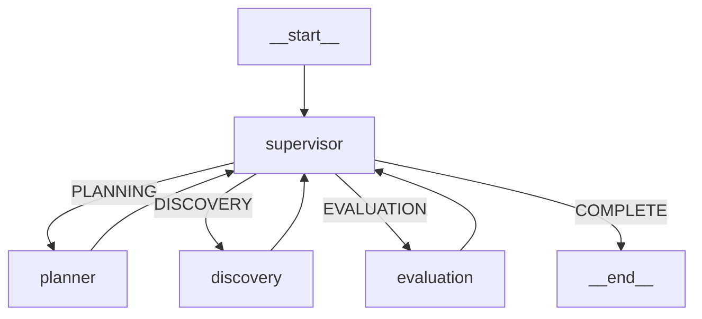

# Architecture — AGI Research Multi-Agent System



## Phase Flow

```
INITIALIZATION → PLANNING → DISCOVERY → EVALUATION → COMPLETION
```

- **supervisor** — Coordinates phase transitions, routes to the correct node, generates the final report on completion.
- **planner** — LLM parses the research query into a JSON execution plan (keywords, date range, max papers).
- **discovery** — LangChain agent calls arXiv API, deduplicates results, validates abstracts.
- **evaluation** — LLM scores each paper on 10 weighted AGI parameters (0–100 scale).
