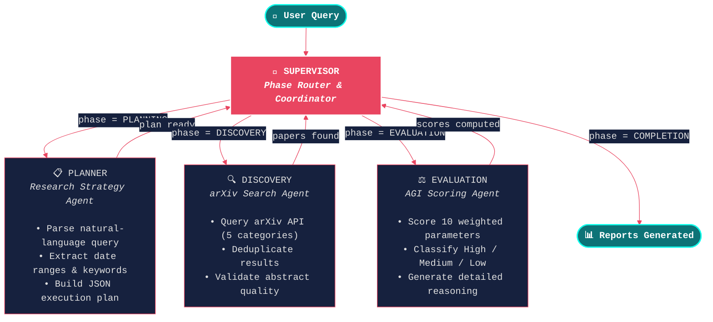
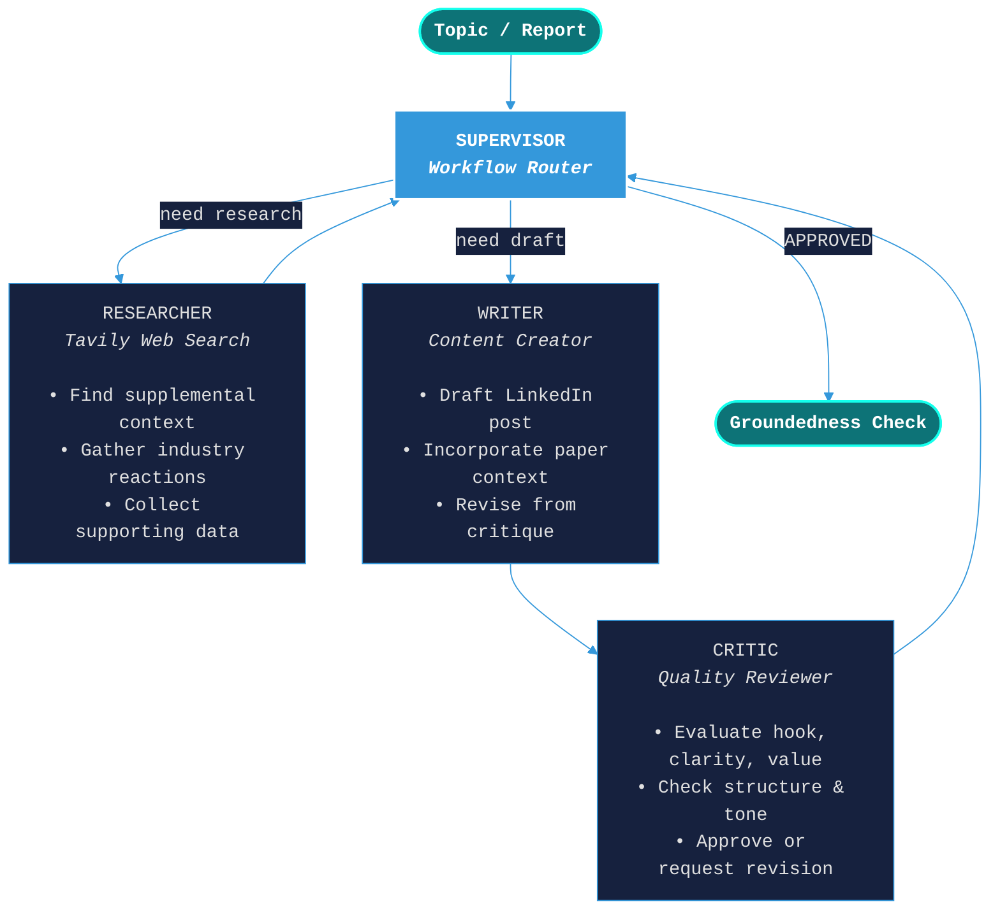

# Agentic arXiv Creator

> **A multi-agent AI system that discovers, evaluates, and ranks arXiv papers — then generates LinkedIn posts from top findings. Powered by Anthropic Claude and LangGraph.**

[](https://www.python.org/downloads/)
[](https://www.anthropic.com/)
[](https://github.com/langchain-ai/langgraph)
[](https://opensource.org/licenses/MIT)

---

## Overview

**Agentic arXiv Creator** is an autonomous research system that uses a team of specialized AI agents to search arXiv for cutting-edge papers, evaluate them against domain-specific rubrics, and optionally generate polished LinkedIn posts from the top-ranked findings.

### Key Capabilities

- **Autonomous Research Planning** — An LLM agent interprets natural-language queries into structured execution plans with keywords, date ranges, and search strategies.
- **Intelligent Paper Discovery** — A tool-augmented agent searches arXiv across LLM-selected categories, with automatic deduplication and quality validation.
- **Multi-Domain Evaluation** — Papers are scored on 10 weighted parameters using domain-specific rubrics (AGI, ML, Finance, Economics) to produce a 0–100 relevance score.
- **Structured Reporting** — Generates both executive summary and detailed evaluation reports in Markdown.
- **LinkedIn Post Creator** — A second multi-agent pipeline (Supervisor → Researcher → Writer → Critic) generates professional LinkedIn posts, with Tavily web search and groundedness evaluation.
- **End-to-End Orchestration** — `run_pipeline.py` chains the research pipeline into the LinkedIn creator, seeding posts from the highest-scored paper automatically.

---

## Architecture

The system is built as a **cyclic state graph** using [LangGraph](https://github.com/langchain-ai/langgraph), where a central **Supervisor** node orchestrates phase transitions between three specialized worker nodes. Each node returns control to the Supervisor, which decides the next step based on the current pipeline state.



### Phase Flow

```
INITIALIZATION ➤ PLANNING ➤ DISCOVERY ➤ EVALUATION ➤ COMPLETION
```

| Phase | Agent | What It Does |
|-------|-------|--------------|
| **Planning** | Planner | Parses the user query with an LLM to produce a structured JSON execution plan (search keywords, date range, categories, max papers). Falls back to sensible defaults on failure. |
| **Discovery** | Discovery Agent | Uses a LangChain `create_agent` with a custom `@tool` to call the arXiv API. Deduplicates by normalized title, filters papers with abstracts < 50 chars, and collects metadata. |
| **Evaluation** | Evaluator | Sends each paper through a structured prompt asking Claude to rate 10 AGI parameters (1–10 scale). Scores are weighted and aggregated into a 0–100 composite score with classification. |
| **Completion** | Supervisor | Writes final executive summary and detailed evaluation report to the `reports/` directory. |

---

## LinkedIn Post Creator Pipeline

A second multi-agent pipeline generates professional LinkedIn posts from research findings or standalone topics.



| Agent | Role |
|-------|------|
| **Supervisor** | Routes between agents based on state (research needed → draft needed → approved). |
| **Researcher** | Uses Tavily Search to find supplemental web context around the paper or topic. |
| **Writer** | Generates/revises a LinkedIn post using paper context + research findings. |
| **Critic** | Evaluates hook strength, clarity, structure, and engagement potential. Approves or requests revision. |
| **Groundedness** | Post-pipeline check that verifies every factual claim is supported by research findings. |

---

## Anthropic Claude Integration

This project exclusively uses **Anthropic Claude** models via [`langchain-anthropic`](https://python.langchain.com/docs/integrations/chat/anthropic/). All LLM calls — planning, tool-use orchestration, and structured evaluation — are routed through `ChatAnthropic`.

### Why Claude?

| Feature | Benefit in This Pipeline |
|---------|---------------------------|
| **Structured JSON output** | Claude reliably produces valid JSON for execution plans and evaluation scores, reducing parse failures. |
| **Long-context reasoning** | Handles full paper abstracts and multi-parameter evaluation prompts in a single pass. |
| **Tool calling** | Native function/tool calling support powers the Discovery Agent's arXiv search integration. |
| **Low hallucination rate** | Critical for accurate AGI parameter scoring — each score requires grounded reasoning. |

### Model Configuration

```python
ChatAnthropic(
    model="claude-sonnet-4-20250514",   # configurable via ANTHROPIC_MODEL env var
    temperature=0.0,                  # deterministic for evaluation; 0.2 for planning
    max_tokens=4096,                  # configurable via ANTHROPIC_MAX_TOKENS
)
```

The LLM client includes **automatic retry** with exponential backoff (via `tenacity`) for transient Anthropic API errors (`APIError`, `RateLimitError`, `APITimeoutError`), making the pipeline resilient to rate limits and network blips.

---

## AGI Evaluation Framework

Each paper is scored across **10 weighted parameters** that together capture the breadth of AGI-relevant capabilities:

| # | Parameter | Weight | What It Measures |
|---|-----------|--------|------------------|
| 1 | Novel Problem Solving | 15% | Ability to solve new, unseen problems |
| 2 | Few-Shot Learning | 15% | Learning effectively from minimal examples |
| 3 | Task Transfer | 15% | Applying skills across different domains |
| 4 | Abstract Reasoning | 12% | Logical thinking and pattern recognition |
| 5 | Contextual Adaptation | 10% | Adapting behavior to changing contexts |
| 6 | Multi-Rule Integration | 10% | Following and combining complex rule sets |
| 7 | Generalization Efficiency | 8% | Generalizing from small datasets |
| 8 | Meta-Learning | 8% | Learning how to learn |
| 9 | World Modeling | 4% | Building models of complex environments |
| 10 | Autonomous Goal Setting | 3% | Setting and pursuing own objectives |

**Scoring**: Each parameter is rated 1–10 by Claude with explicit reasoning. The weighted sum is normalized to a **0–100 AGI Score** and classified as:

- **High AGI Potential** (≥ 70)
- **Medium AGI Potential** (40–69)
- **Low AGI Potential** (< 40)

---

## Multi-Agent System Design

The system follows a **Supervisor-Worker** pattern implemented with LangGraph's `StateGraph`:

```
┌─────────────────────────────────────────────────────────┐
│                    LangGraph StateGraph                  │
│                                                         │
│   ┌───────────┐    ┌──────────┐    ┌──────────────┐    │
│   │  Planner  │    │ Discovery│    │  Evaluator   │    │
│   │   Agent   │    │   Agent  │    │    Agent     │    │
│   │           │    │          │    │              │    │
│   │ • LLM     │    │ • LLM    │    │ • LLM       │    │
│   │ • Prompts │    │ • Tools  │    │ • Prompts   │    │
│   │           │    │ • arXiv  │    │ • Scoring   │    │
│   └─────┬─────┘    └────┬─────┘    └──────┬───────┘    │
│         │               │                 │            │
│         └───────┬───────┴────────┬────────┘            │
│                 │                │                      │
│           ┌─────▼─────┐   ┌─────▼──────┐              │
│           │ Supervisor │   │   Shared   │              │
│           │  (Router)  │◄──│   State    │              │
│           └────────────┘   └────────────┘              │
└─────────────────────────────────────────────────────────┘
```

**Key design decisions:**

- **Shared `TypedDict` state** — All agents read from and write to a single `ResearchSystemState` dictionary, enabling clean inter-agent data flow without message passing complexity.
- **Conditional routing** — The Supervisor uses `add_conditional_edges` to route to the correct phase node based on the `current_phase` enum, then each worker returns to the Supervisor via a fixed edge.
- **Tool-augmented Discovery** — The Discovery Agent is the only agent with tool access (the `@tool`-decorated `discover_and_process_papers` function), keeping the tool surface minimal and focused.
- **Resilient JSON parsing** — Multiple fallback strategies (regex extraction, trailing-comma fix, field-by-field extraction) ensure evaluation results are captured even when the LLM produces slightly malformed JSON.

---

## Setup

### Prerequisites

- Python `3.11` or `3.12` (LangChain may emit warnings on `3.14+`)
- An [Anthropic API key](https://console.anthropic.com/)

### Installation

```bash
git clone https://github.com/alanvaa06/Agentic_arXiv_creator.git
cd Agentic_arXiv_creator
python -m venv .venv

# Windows
.venv\Scripts\activate
# macOS / Linux
source .venv/bin/activate

pip install -r requirements.txt
```

### Configuration

Copy the example environment file and add your API key:

```bash
cp .env.example .env
```

| Variable | Required | Default | Description |
|----------|----------|---------|-------------|
| `ANTHROPIC_API_KEY` | Yes | — | Your Anthropic API key |
| `TAVILY_API_KEY` | Yes* | — | Tavily API key (*required for LinkedIn pipeline) |
| `ANTHROPIC_MODEL` | No | `claude-sonnet-4-20250514` | Claude model to use |
| `ANTHROPIC_MAX_TOKENS` | No | `4096` | Max tokens per LLM call |
| `LOG_LEVEL` | No | `INFO` | Logging verbosity |
| `REPORT_OUTPUT_DIR` | No | `reports` | Output directory for reports |
| `MAX_REVISIONS` | No | `5` | Max revision cycles for LinkedIn post |

---

## Usage

### Research Pipeline

```bash
# AGI-focused search (default)
python research_multi_agent_system.py \
  --query "Find AGI papers from Jan 1st 2026 to Jan 31st 2026" \
  --max-papers 10

# Domain-specific search
python research_multi_agent_system.py \
  --query "portfolio optimization with deep learning" \
  --domain finance --max-papers 5
```

### LinkedIn Post Creator

```bash
# Standalone post from a topic
python linkedin_post_creator.py \
  --topic "The future of multi-agent AI systems"

# Seed from an evaluation report (top-ranked paper)
python linkedin_post_creator.py \
  --from-report reports/evaluation_detailed_report_<uuid>.md
```

### End-to-End Pipeline

```bash
# Research → Evaluate → LinkedIn post (single command)
python run_pipeline.py \
  --query "transformer architectures for time series" \
  --domain ml --max-papers 5
```

### Output

| File | Description |
|------|-------------|
| `reports/final_report.md` | Executive summary with top papers, scores, and recommendations |
| `reports/evaluation_detailed_report_<uuid>.md` | Per-paper breakdown with parameter scores and reasoning |
| `reports/linkedin_post_<timestamp>.md` | Generated LinkedIn post with groundedness evaluation |

---

## Tech Stack

| Component | Technology |
|-----------|------------|
| **LLM Provider** | [Anthropic Claude](https://www.anthropic.com/) via `langchain-anthropic` |
| **Agent Orchestration** | [LangGraph](https://github.com/langchain-ai/langgraph) `StateGraph` |
| **Agent Framework** | [LangChain](https://www.langchain.com/) (`create_agent`, tools, messages) |
| **Paper Source** | [arXiv API](https://arxiv.org/) via `arxiv` Python client |
| **Web Search** | [Tavily](https://tavily.com/) via `langchain-tavily` (LinkedIn pipeline) |
| **Retry / Resilience** | `tenacity` with exponential backoff |
| **Configuration** | `python-dotenv` + environment variables |

---

## Project Structure

```
Agentic_arXiv_creator/
├── research_multi_agent_system.py   # Research pipeline (Planner → Discovery → Evaluation)
├── linkedin_post_creator.py         # LinkedIn pipeline (Supervisor → Researcher → Writer → Critic)
├── run_pipeline.py                  # End-to-end orchestrator (research → LinkedIn)
├── requirements.txt                 # Python dependencies
├── .env.example                     # Environment variable template
├── .gitignore                       # Git ignore rules
├── ARCHITECTURE.md                  # Mermaid architecture diagram
├── CLAUDE.md                        # Agent behavioral directives
├── context/
│   ├── memory.md                    # Shared project memory
│   └── tasks/
│       ├── todo.md                  # Task tracker
│       └── self-correction.md       # Agent learning log
└── reports/                         # Generated output (git-ignored)
    ├── final_report.md
    ├── evaluation_detailed_report_<uuid>.md
    └── linkedin_post_<timestamp>.md
```

---

## License

MIT
